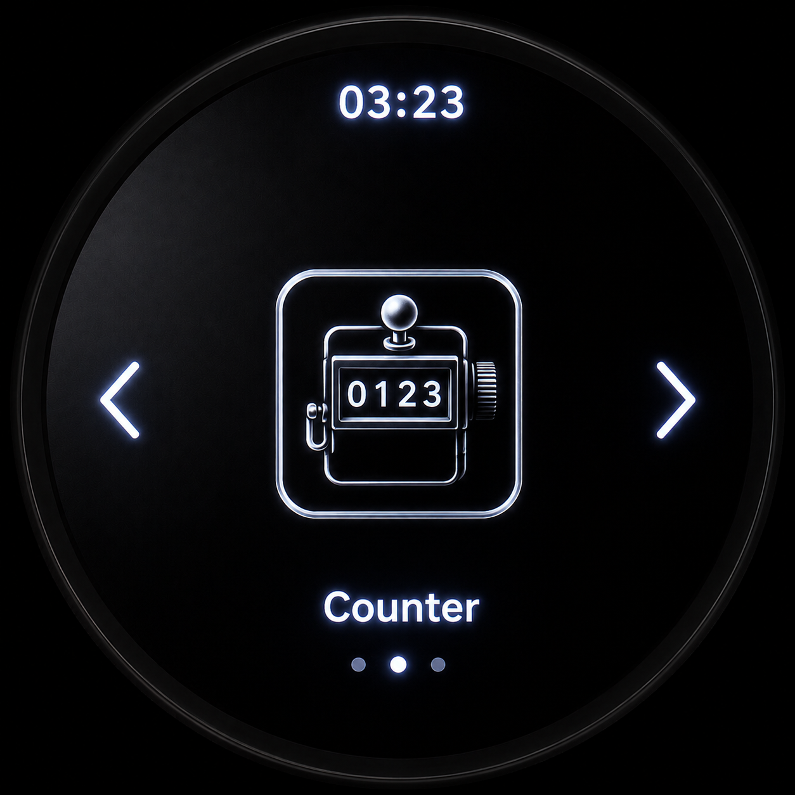
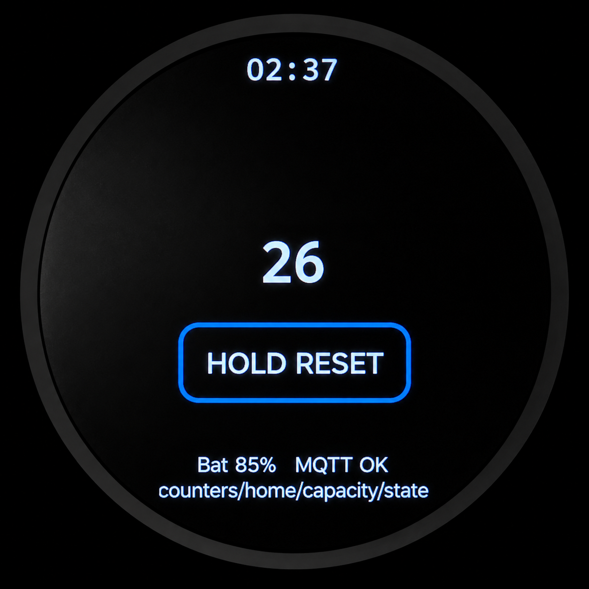
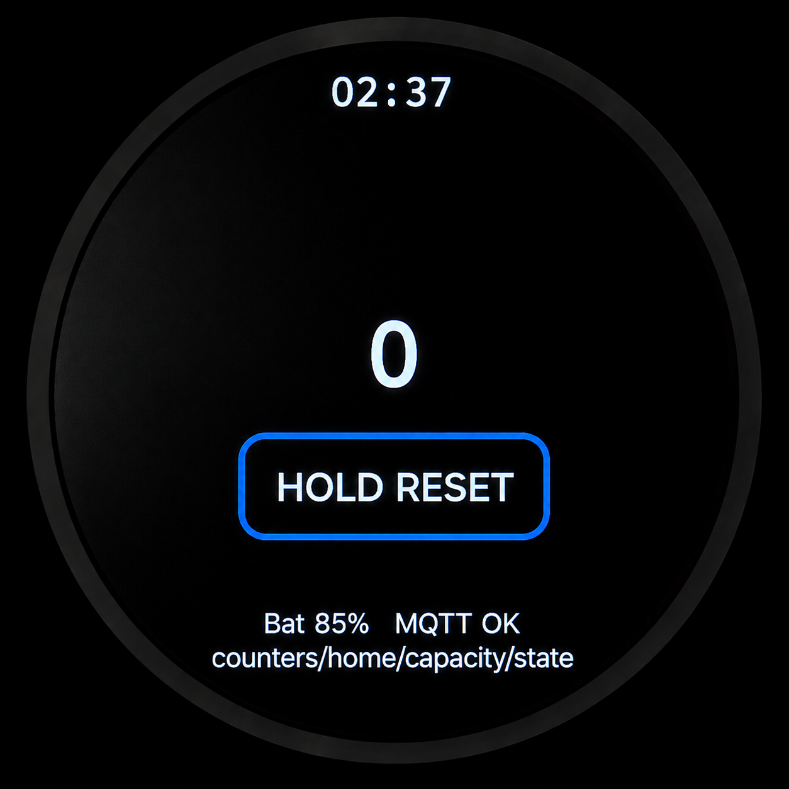
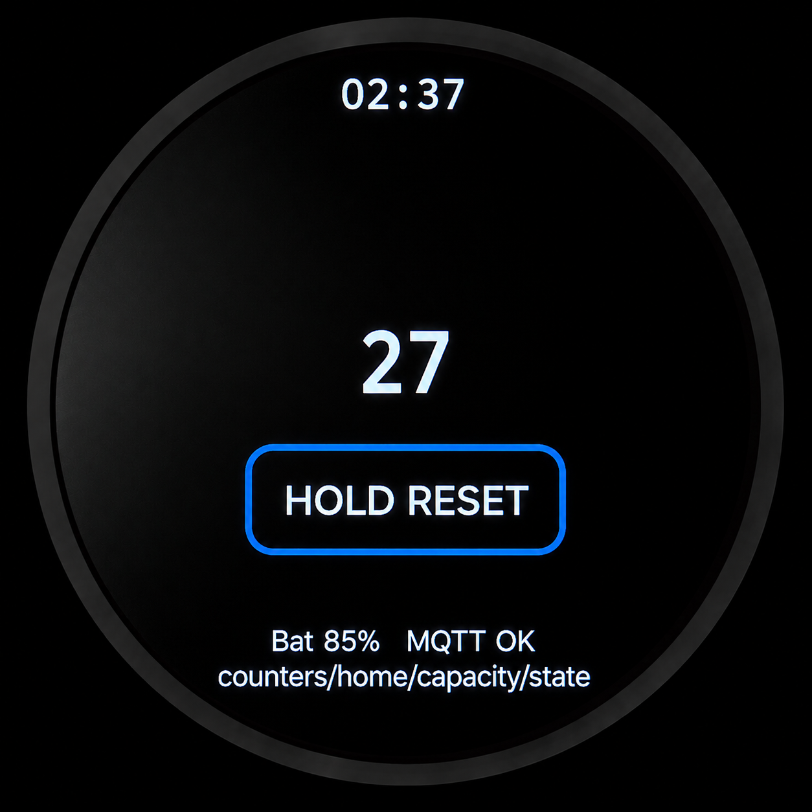
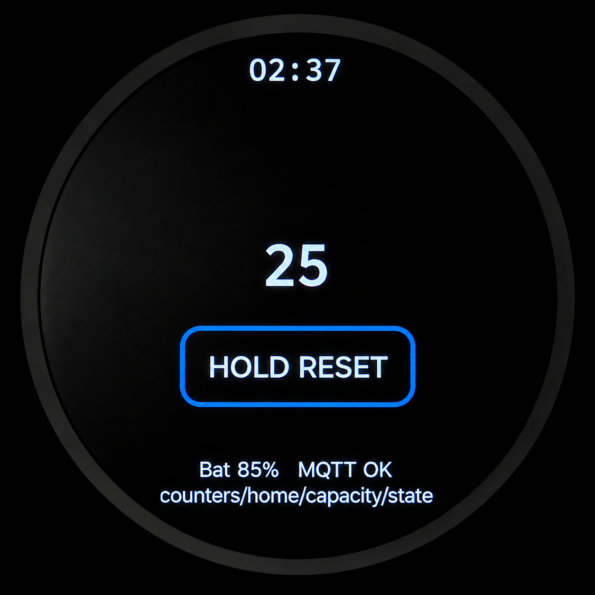

# M5StopWatch MQTT Counter

MQTT-synchronized capacity counter firmware for the M5Stack StopWatch.



## Overview

M5StopWatch MQTT Counter turns the M5Stack StopWatch into a battery-powered venue capacity counter. The firmware adds a dedicated **Counter** app to the StopWatch launcher, displays the shared count on the round 466 × 466 AMOLED screen, and synchronizes count changes over MQTT.

The project is built with **ESP-IDF** and is based on the original M5Stack StopWatch User Demo firmware. The current firmware focuses on reliable physical-button counting, MQTT synchronization, Wi-Fi/AP Portal provisioning, configurable wake/sleep behavior, long-press reset protection, battery publishing, AMOLED-friendly UI assets, and power-management work for hanging/lanyard use.

## Current Features

- Counter app integrated into the StopWatch launcher.
- AMOLED-optimized Counter launcher icon.
- Round LVGL Counter app UI with true-black background.
- Arc-top clock/status UI shared with the launcher style.
- Physical button controls:
  - `KEYB` / Go Next increments.
  - `KEYA` / Go Previous decrements.
- Touchscreen **HOLD RESET** button with approximately 2-second long-press protection.
- Count clamped at zero.
- Last count persisted to NVS.
- Dedicated `wifi_service` for Wi-Fi connection management and recovery.
- AP Portal support for first-time Wi-Fi provisioning and network recovery.
- MQTT state synchronization through the configured counter state topic.
- State publish payload includes the device name.
- Incoming state accepts a plain integer or JSON with a `value` field.
- Battery percentage publishing on a derived battery topic.
- Settings app controls for Wi-Fi, MQTT, wake behavior, appliance mode, and startup app.
- Configurable Soft Sleep and Deep Sleep timeouts from **Settings → Device → Wake Settings**.
- Optional startup directly into the Counter app.

## User Interface

### Launcher

The Counter app appears in the StopWatch launcher carousel with the AMOLED-optimized Counter icon.


### Counter App

The Counter app shows the current count, a long-press reset button, battery level, MQTT connection state, and the active counter topic.



### Reset Protection

The touchscreen reset button is intentionally labeled **HOLD RESET**. A reset is only requested after the reset button is held for approximately two seconds.



## Hardware

Target device:

- M5Stack StopWatch
- ESP32-S3
- Round 466 × 466 AMOLED touchscreen display
- Integrated battery
- IMU motion sensor
- Physical KEYA and KEYB buttons

## Controls

| Control | Function |
| --- | --- |
| KEYB / Go Next | Increment |
| KEYA / Go Previous | Decrement |
| Touchscreen **HOLD RESET** button | Reset after long press |
| Home gesture/button event | Return to launcher |

## Wi-Fi and Provisioning

The firmware uses `main/apps/common/network/wifi_service` as the central Wi-Fi manager. It owns Wi-Fi startup, connection status, recovery, and sleep/wake coordination.

The AP Portal is used for first-time configuration and recovery when stored Wi-Fi credentials are missing or no longer work. After Wi-Fi is available, `mqtt_service` uses that connection to reach the MQTT broker, subscribe to counter/time topics, and publish counter and battery state.

See [`docs/wifi.md`](docs/wifi.md) for more detail.

## MQTT Defaults

Default device/runtime configuration is defined in `components/device_config`.

| Setting | Default |
| --- | --- |
| Device name | `Capacity-01` |
| MQTT broker URI | `mqtt://smbhub.local:1883` |
| Counter state topic | `counters/capacity/state` |
| Battery topic | Derived from state topic: `counters/capacity/battery` |
| Time sync topic | `system/time/epoch` |

### State Payloads

The firmware publishes retained QoS 1 JSON state to the configured counter topic:

```json
{"value":30,"updated_by":"Capacity-01"}
```

Incoming counter state may be either a plain integer or JSON containing a `value` field.

### Battery Payloads

Battery publishes to the derived battery topic, for example:

```text
counters/capacity/battery
```

Payload:

```json
{"battery":84,"device":"Capacity-01"}
```

## System Architecture

```text
      ┌─────────────────┐
      │ StopWatch #1    │
      │ Counter app     │
      └───────┬─────────┘
              │ Wi-Fi / MQTT state / battery
              ▼
      ┌─────────────────┐
      │ MQTT Broker     │
      │ Mosquitto       │
      └───────┬─────────┘
              │
              ▼
      ┌─────────────────┐
      │ Node-RED        │
      │ authoritative   │
      │ counter logic   │
      └───────┬─────────┘
              │ retained state
      ┌───────┴──────────────┐
      ▼                      ▼
StopWatch #2           Web dashboard /
Other clients          other MQTT clients
```

Node-RED remains the recommended authoritative owner of the shared counter value. StopWatch devices subscribe to the state topic and publish updated values when local button or reset actions occur.

See [`docs/architecture.md`](docs/architecture.md), [`docs/wifi.md`](docs/wifi.md), and [`docs/mqtt.md`](docs/mqtt.md) for more detail.

## Screenshots

| Screen | Preview |
| --- | --- |
| Launcher, Counter selected |  |
| Counter app |  |
| Increment |  |
| Decrement |  |
| Reset |  |

## Documentation

- [Architecture](docs/architecture.md)
- [Wi-Fi Architecture](docs/wifi.md)
- [MQTT Integration](docs/mqtt.md)
- [Building and Flashing](docs/building.md)
- [Power Management](docs/power-management.md)
- [Screenshots](docs/screenshots/README.md)

## Development Environment

This project is developed and flashed with Espressif ESP-IDF.

### Requirements

- ESP-IDF v5.5.x recommended
- Python 3.x
- Git
- USB-C connection to the M5Stack StopWatch

### Clone Repository

```bash
git clone https://github.com/slochewie/M5StopWatch-MQTT-Counter.git
cd M5StopWatch-MQTT-Counter
```

### Configure Target

```bash
idf.py set-target esp32s3
```

Optional:

```bash
idf.py menuconfig
```

### Build

```bash
idf.py build
```

The generated application binary is named from the root ESP-IDF project declaration:

```text
build/StopWatch-MQTT-Counter.bin
```

### Flash

```bash
idf.py flash
```

### Monitor

```bash
idf.py monitor
```

Flash and monitor:

```bash
idf.py flash monitor
```

## Repository Structure

```text
M5StopWatch-MQTT-Counter/
├── main/
│   ├── apps/
│   │   ├── app_counter/
│   │   ├── app_launcher/
│   │   ├── app_setup/
│   │   └── common/
│   │       ├── network/
│   │       │   ├── wifi_service.*
│   │       │   └── mqtt_service.*
│   │       └── sleep_manager/
│   └── assets/
│       └── images/
├── components/
│   ├── counter_service/
│   └── device_config/
├── docs/
│   ├── architecture.md
│   ├── building.md
│   ├── mqtt.md
│   ├── power-management.md
│   ├── wifi.md
│   └── screenshots/
├── CMakeLists.txt
├── sdkconfig.defaults
└── README.md
```

## Power Management Status

Power management is active development but no longer purely theoretical.

Current behavior in the system sleep manager:

- Soft Sleep and Deep Sleep are configurable in **Settings → Device → Wake Settings**.
- Soft Sleep defaults to 15 seconds and can be set to Never, 15 seconds, 30 seconds, 45 seconds, 1 minute, or 2 minutes.
- Deep Sleep defaults to 45 seconds and can be set to Never, 30 seconds, 45 seconds, 1 minute, 2 minutes, 5 minutes, 10 minutes, or 30 minutes.
- Both sleep stages are only entered while the StopWatch is in the hanging/lanyard orientation.
- Soft Sleep turns off the backlight, sleeps the display, pauses Wi-Fi/MQTT recovery, and stops Wi-Fi.
- Soft Sleep wakes from touch or physical button activity.
- Deep Sleep is configured for touch wake on GPIO13 / `G13_TP_INT`.
- Network recovery is deferred until needed after wake.

See [`docs/power-management.md`](docs/power-management.md) for details and known limitations.

## Related Projects

### Original Firmware

- [M5Stack StopWatch User Demo](https://github.com/m5stack/M5StopWatch-UserDemo)

### Companion Projects

- [M5StickS3 MQTT Counter](https://github.com/slochewie/M5StickS3-MQTT-Counter)
- Node-RED Capacity Counter
- Counter Web Dashboard
- GeekMagic SmallTV Pro MQTT Display

## Status

Active development.

Recent focus:

- Counter launcher integration
- AMOLED-optimized launcher artwork
- Wi-Fi service and AP Portal provisioning
- MQTT synchronization reliability
- Configurable wake/sleep settings
- Long-press reset safety
- Battery publishing
- Settings controls for Wi-Fi/MQTT/wake/startup behavior
- Round-display UI documentation
- Sleep/wake architecture testing
